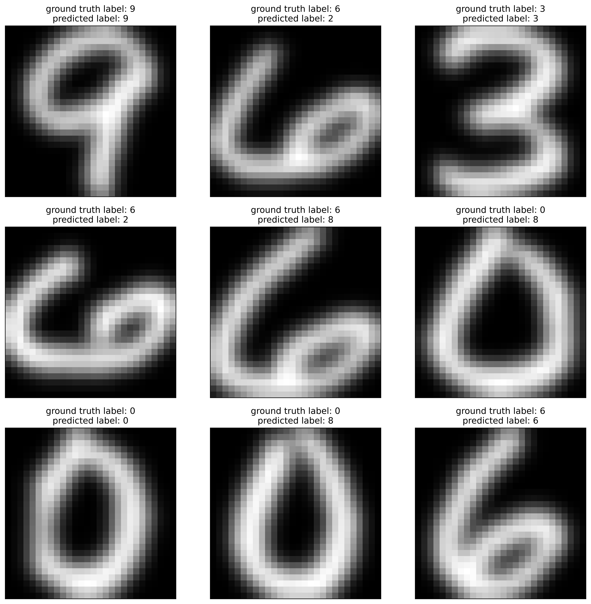

# ADDA
Implementation of ADDA (**A**dversarial **D**iscriminative **D**omain **A**daptation) paper published in CVPR2017
```bibtex
@InProceedings{Tzeng_2017_CVPR,
  author = {Tzeng, Eric and Hoffman, Judy and Saenko, Kate and Darrell, Trevor},
  title = {Adversarial Discriminative Domain Adaptation},
  booktitle = {Proceedings of the IEEE Conference on Computer Vision and Pattern Recognition (CVPR)},
  month = {July},
  year = {2017}
}
```
<p align="center">
  
</p>
